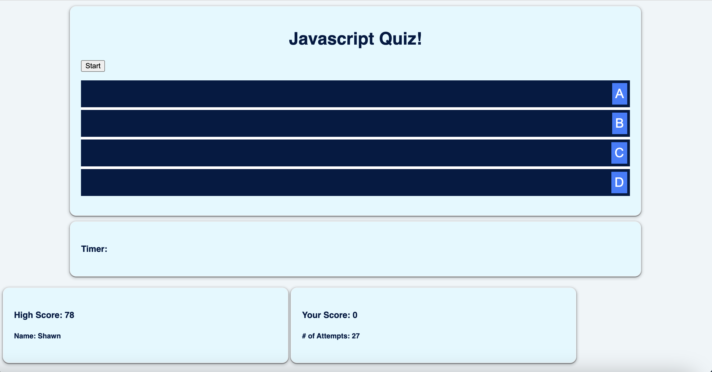
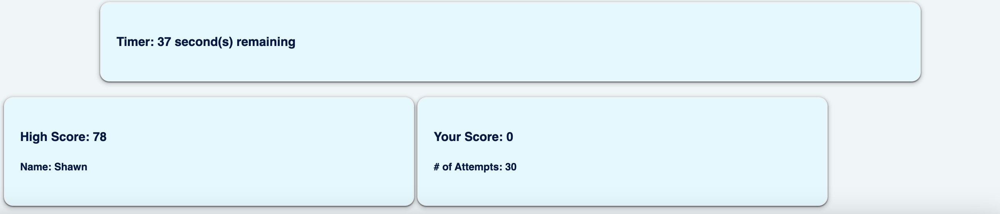

# Bootcamp Challenge 4 - Javascript Quiz 
# Shawn Robinson 

## **Description**
The "Javascript Quiz" application serves as a fun and engaging learning platform for anyone interested in testing their Javascript knowledge!  

The application has an inviting and minimal interface. 

After the user presses the "start" button, the quiz will begin! 

Users gain five points for each question they get correct. They will also be rewarded with an attractive sound effect! 

Users gain zero points if they answer incorrectly. Ten seconds will also be deducted from their overall time to finish! 

Elements that make this Javascript quiz stand out from other available options is the fact that the application provides the user with audio feedback to know whether they were correct or incorrect on their last question.

Also, the application stores how many attempts users have taken on the quiz overall. 

How long will it take YOU to hit a high score? Try the "Javascript Quiz" application today! 

# Application Link 

Try my "Javascript Quiz" application for yourself at:
https://shawnbradyrobinson.github.io/bootcamp-challenge-4/

## Credits
- The general card styling in CSS was inspired by EdX Full Stack Code Bootcamp's "To Do Tracker" App, which was student activity 24 in Week Four. 

- I used this resource to learn how to implement sound within an event handler: https://www.youtube.com/watch?v=eRTe4uaiSpc

- The correct sound effect is sourced from this Youtube video: https://www.youtube.com/watch?v=mQSmVZU5EL4

- The incorrect sound effect is sourced from this Youtube video: https://www.youtube.com/watch?v=y0vbTOlq_Sg

## License

MIT License

Copyright (c) 2023 shawnbradyrobinson

Permission is hereby granted, free of charge, to any person obtaining a copy
of this software and associated documentation files (the "Software"), to deal
in the Software without restriction, including without limitation the rights
to use, copy, modify, merge, publish, distribute, sublicense, and/or sell
copies of the Software, and to permit persons to whom the Software is
furnished to do so, subject to the following conditions:

The above copyright notice and this permission notice shall be included in all
copies or substantial portions of the Software.

THE SOFTWARE IS PROVIDED "AS IS", WITHOUT WARRANTY OF ANY KIND, EXPRESS OR
IMPLIED, INCLUDING BUT NOT LIMITED TO THE WARRANTIES OF MERCHANTABILITY,
FITNESS FOR A PARTICULAR PURPOSE AND NONINFRINGEMENT. IN NO EVENT SHALL THE
AUTHORS OR COPYRIGHT HOLDERS BE LIABLE FOR ANY CLAIM, DAMAGES OR OTHER
LIABILITY, WHETHER IN AN ACTION OF CONTRACT, TORT OR OTHERWISE, ARISING FROM,
OUT OF OR IN CONNECTION WITH THE SOFTWARE OR THE USE OR OTHER DEALINGS IN THE
SOFTWARE.

---